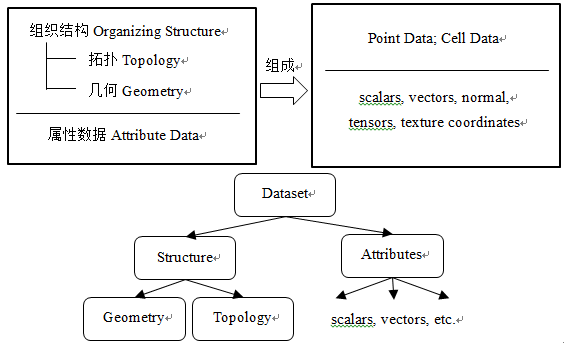

# 6、VTK 基本数据结构

版权声明：本文为 CSDN 博主「DolingStudio」的原创文章，遵循 CC 4.0 by-sa 版权协议，转载请附上原文出处链接及本声明。

原文链接：https://blog.csdn.net/www_doling_net/article/details/8562826

----

我们已经学习了 VTK 的一个重要概念——可视化管线，了解了 VTK 数据的流动过程。好比我们做一道菜，在做每一道菜之前，首先要掌握这道菜的做法，什么时候放盐什么时候放酱油等调料，除了需要弄清楚做每一道菜的流程，还需要了解所做的每一道菜的原料，比如有些原料是要蒸出来才比较好吃，有些则可能会用炖的方法才比较可口，只有掌握做菜的流程以及了解菜的原料的特点，最后做出来的菜才可口美味。如果说 VTK 可视化管线是完成 VTK 应用程序这道菜的基本步骤，那么 VTK 的数据结构就好比我们做每一道菜的基本原料。针对可视化领域的特点，VTK 定义了种类丰富的数据结构，这一章我们重点学习 VTK 的基本数据结构，了解这些数据结构，有助于我们写出更有针对性的、更高效的可视化应用程序。

## 6.1 可视化数据的基本特点

我们的目的是要对数据进行可视化，因此有必要对可视化的数据特点作一了解。归纳起来，可视化数据具有如下一些特点：

### 离散性

为了让计算机能够获取、处理和分析数据，必须对无限、连续的空间体进行采样，生成有限的采样数据点，这些数据以离散点的形式存储，采样的过程是一个离散化的过程。

由于可视化数据的离散性特点，在某些离散点上有精确的值存在，但点与点之间的值则是不可知的，要得到采样点之外的其他点的值，只有通过插值 (Interpolation) 的方法获取。常用的插值方法是线性插值，要得到更精确的数值可以采用非线性插值，如 B 样条插值方法。

### 数据具有规则或不规则的结构（或者说结构化与非结构化）

可视化数据可以分为规则 (Regular) 和不规则 (Irregular) 或者说结构化 (Structured) 和非结构化 (Unstructured) 。规则结构数据点之间有固定的关联关系，可以通过这些关联确定每个点的坐标，不规则结构数据之间没有固定的关联关系。

对于规则结构的数据，存储时不必存储所有的数据点，只需存储起始点、相邻两点之间的间隔以及点的总数就可以保存完整的数据信息。对于不规则结构的数据，虽然不可以像规则结构的数据那样存储，但它也有自身的优势，即在数据变化频繁的区域可以密集表示，而数据变化不频繁的区域则稀疏表示。规则结构的数据可以在存储及计算时占优势，不规则结构的数据虽然存储和计算时不能像规则结构的那样高效，但它在数据表达方面相对而言则更加自由，更加细致、灵活的表现数据。

### 数据具有维度

可视化数据的第三个特点是拓扑维度 (Topological Dimension)。可视化数据具有零维、一维、二维、三维等任意维度。如，零维的数据表现为点，一维数据表现为曲线，二维数据表现为曲面，三维数据表现为体等。数据的维度决定了数据可视化的方法，如，对于二维的数据，可以将数据存储到一个矩阵，然后再采用针对二维数据的可视化方法进行可视化（如等高图）。

## 6.2 vtkDataObject 和 vtkDataSet

### 6.2.1 vtkDataObject

在 VTK 中，数据一般以数据对象（Data Object，对应 VTK 里的类 vtkDataObject）的形式表现，是 VTK 
 (Structure) 后，才能被 VTK 提供的可视化算法处理。

图 6.1 是 vtkDataObject 类的继承图，VTK 里所有的数据结构形式都是从这个类派生出来的，实际的 VTK 应用程序中，没有直接使用 vtkDataObject 来实例化数据对象，而是根据具体的可视化数据选用其具体的子类实现可视化的。

(TODO)

图 6.1 vtkDataObject 类的继承图

### 6.2.2 vtkDataSet

数据对象被组织成一种结构并且被赋予相应的属性值时就形成数据集 (Dataset)。VTK 里与数据集对应的类是 vtkDataSet，该类从 vtkDataObject 直接派生。vtkDataSet 由两个部分组成，即 **组织结构** (Organizing Structure) 以及与组织结构相关联的 **属性数据** (Attribute Data)，图 6.2 描述了 vtkDataSet 各结构的详细构成。vtkDataSet 是一个抽象基类，结构的实现及表达由其具体的子类来完成。

vtkDataSet 的组织结构由 **拓扑结构** (Topology) 和 **几何结构** (Geometry)两部分组成。拓扑结构描述了物体的构成形式，几何结构描述了物体的空间位置关系。换言之，点数据 (Point Data) 所定义的一系列坐标点构成了 vtkDataSet (数据集) 的几何结构；点数据的连接（点的连接先形成单元数据 (Cell Data)，由单元数据再形成拓扑）就形成了数据集的拓扑结构。比如，我们想要在屏幕上显示一个三角形，首先我们必须定义三角形三个点的坐标（即 Point Data，记三个点为 P1, P2 和 P3），然后将这三个点按照一定的顺序连接起来（P1-P2-P3，或者是 P3-P2-P1 的顺序)，这三个点定义了数据集的几何结构，它们的连接就构成了数据集的拓扑结构。亦即，点数据 (Point Data) 定义数据集的几何结构，单元数据 (Cell Data) 定义数据集的拓扑结构，要形成完整的数据集，必须有几何和拓扑两种结构。

关于拓扑、几何结构以及属性数据的更多解释：拓扑结构具有几何变换不变性。例如，说一个多边形是三角形，即指其拓扑结构，而给定的每个点的坐标，则为其几何结构。几何结构是一种空间描述，与空间变换有紧密联系，常见的变换有旋转、平移和缩放。属性数据是对拓扑结构和几何结构信息的补充，属性数据可以是某个空间点的温度值，也可以是某个单元的质量之类的。



<p align="center">图 6.2 vtkDataSet 的结构组成</p>

接下来我们通过例子说明怎么把几何结构和拓扑结构加入到数据集 (vtkDataSet) 中去。先看一下只有几何结构，没有拓扑结构的 vtkDataSet。

```cpp
#include <vtkPoints.h>
#include <vtkPolyData.h>
#include <vtkPolyDataWriter.h>
#include <vtkSmartPointer.h>

int main(int argc, char* argv[]) {
  // 创建点数据
  auto points = vtkSmartPointer<vtkPoints>::New();
  points->InsertNextPoint(1.0, 0.0, 0.0);
  points->InsertNextPoint(0.0, 0.0, 0.0);
  points->InsertNextPoint(0.0, 1.0, 0.0);

  // 创建 vtkPolyData 类型的数据，vtkPolyData 派生自 vtkPointSet，后者又派生自
  // vtkDataSet。
  auto poly_data = vtkSmartPointer<vtkPolyData>::New();
  // 设置点数据，即指定几何结构。
  poly_data->SetPoints(points);

  // Write the data set to file.
  auto writer = vtkSmartPointer<vtkPolyDataWriter>::New();
  writer->SetFileName("TrianglePoints.vtk");
  writer->SetInputData(poly_data);
  writer->Write();

  return 0;
}
```

TrianglePoints 示例中，首先创建了一个点数据 (vtkPoints)，里面含有三个点；紧接着创建了一个类型为 vtkPolyData 的数据，vtkPolyData 派生自类 vtkPointSet，而 vtkPointSet 又派生自 vtkDataSet，所以说 vtkPolyData 是一种具体的数据集；然后将创建的点数据加入到数据集，于是点数据就定义了该数据集的几何结构；最后把 vtkPolyData 的数据用类 vtkPolyDataWriter 写入到 TrianglePoints.vtk 文件。

可以利用 ParaView 软件（http://www.paraview.org，ParaView 是使用 VTK 和 Qt 编写的开源的软件）打开示例中保存的 TrianglePoints.vtk 文件。

TODO

图 6.3 TrianglePoints 生成的数据在 ParaView 软件经 Glyph (符号化) 处理后的结果

使用 ParaView 软件打开该文件以后，在渲染窗口中我们看不到任何东西。这是因为我们只是在数据集 vtkPolyData 的实例里，只定义了数据的几何结构，没有定义拓扑结构。如果你想看一下我们生成的 TrianglePoints.vtk 数据是怎样一种形式，可以调用 ParaView 的菜单 Filters->Common->Glyph (在点数据的空间位置生成符号)，可以看到在三角形的三个顶点位置生成了三个同向的箭头（图 6.3 所示），也就说明了示例中生成的文件 TrianglePoints.vtk 里面确实存在数据，只不过它少了某种结构，导致它无法正常显示而已。

接下来我们再看一个例子，在 TrianglePoints 示例的基础上给数据集定义拓扑结构。

```cpp
#include <vtkCellArray.h>
#include <vtkPoints.h>
#include <vtkPolyData.h>
#include <vtkPolyDataWriter.h>
#include <vtkSmartPointer.h>

int main(int argc, char* argv[]) {
  // 创建点的坐标
  double X[3] = { 1.0, 0.0, 0.0 };
  double Y[3] = { 0.0, 0.0, 1.0 };
  double Z[3] = { 0.0, 0.0, 0.0 };

  // 创建点数据以及在每个点坐标上加入顶点 (Vertex) 类型的单元。
  auto points = vtkSmartPointer<vtkPoints>::New();
  auto vertices = vtkSmartPointer<vtkCellArray>::New();

  for (unsigned int i = 0; i < 3; ++i) {
    // 定义用于存储点索引的中间变量，vtkIdType 就相当于 int、long 等类型
    vtkIdType pid[1];

    // 把每个点坐标加入到 vtkPoints 中，InsertNextPoint() 返回加入的点的索引号，
    // 下面我们需要使用这个索引号来创建顶点类型的单元
    pid[0] = points->InsertNextPoint(X[i], Y[i], Z[i]);

    // 在每个坐标点上分别创建一个顶点，顶点是单元 (Cell) 里的一种类型
    vertices->InsertNextCell(1, pid);
  }

  // 创建 vtkPolyData 对象
  auto poly_data = vtkSmartPointer<vtkPolyData>::New();

  poly_data->SetPoints(points);  // 几何结构
  poly_data->SetVerts(vertices);  // 拓扑结构

  // Write the data set to file.
  auto writer = vtkSmartPointer<vtkPolyDataWriter>::New();
  writer->SetFileName("TriangleVertices.vtk");
  writer->SetInputData(poly_data);
  writer->Write();

  return 0;
}
```

TriangleVertices 示例中的第 16 行实例化了一个 vtkCellArray 的对象，我们已经知道“点数据 (Point Data) 定义数据集的几何结构，单元数据 (Cell Data) 定义数据集的拓扑结构。”由此我们可以知道，vtkCellArray 类型的对象 `vertices` 就是用来指定数据集 `poly_data` 的拓扑结构(第36行)，而 `poly_data` 的几何结构则是由 `points` 来定义的（第 35 行）。

TriangleVertices 示例中定义的数据集的拓扑结构是零维的点，即单元类型是 Vertex。保存的 VTK 文件 TriangleVerts.vtk 在 ParaView 里的显示结果如图 6.4 所示（为了便于观察三角形的三个顶点，图 6.4 显示的时候把点的大小设置成5个像素）。

TODO

图 6.4 TriangleVertices 示例生成的 VTK 文件在 ParaView 的显示结果

接下来我们继续在 TriangleVertices 示例的基础上做一些更改，将零维的点拓扑结构改成一维的线拓扑结构，示例的完整代码如下：

```cpp
#include <vtkCellArray.h>
#include <vtkLine.h>
#include <vtkPoints.h>
#include <vtkPolyData.h>
#include <vtkPolyDataWriter.h>
#include <vtkSmartPointer.h>

int main(int argc, char* argv[]) {
  // 创建点数据
  auto points = vtkSmartPointer<vtkPoints>::New();
  points->InsertNextPoint(1.0, 0.0, 0.0);  // 返回 ID: 0
  points->InsertNextPoint(0.0, 0.0, 0.0);  // 返回 ID: 1
  points->InsertNextPoint(0.0, 1.0, 0.0);  // 返回 ID: 2

  // 第一条线，连接 ID 为 0 和 1 两个点。
  auto line0 = vtkSmartPointer<vtkLine>::New();
  // SetId 的第一个参数是线的两个点的下标，总是 0 和 1。
  line0->GetPointIds()->SetId(0, 0);
  line0->GetPointIds()->SetId(1, 1);

  // 第二条线，连接 ID 为 1 和 2 两个点。
  auto line1 = vtkSmartPointer<vtkLine>::New();
  line1->GetPointIds()->SetId(0, 1);
  line1->GetPointIds()->SetId(1, 2);

  // 第三条线，连接 ID 为 2 和 0 两个点。
  auto line2 = vtkSmartPointer<vtkLine>::New();
  line2->GetPointIds()->SetId(0, 2);
  line2->GetPointIds()->SetId(1, 0);

  // 创建点数据以及在每个点坐标上加入顶点 (Vertex) 类型的单元。
  auto lines = vtkSmartPointer<vtkCellArray>::New();
  lines->InsertNextCell(line0);
  lines->InsertNextCell(line1);
  lines->InsertNextCell(line2);

  // 创建 vtkPolyData 对象
  auto poly_data = vtkSmartPointer<vtkPolyData>::New();

  poly_data->SetPoints(points);  // 几何结构
  poly_data->SetLines(lines);  // 拓扑结构

  // Write the data set to file.
  auto writer = vtkSmartPointer<vtkPolyDataWriter>::New();
  writer->SetFileName("TriangleLines.vtk");
  writer->SetInputData(poly_data);
  writer->Write();

  return 0;
}
```

示例 TriangleLines 生成的 VTK 文件在 ParaView 的显示结果如图 6.5 所示。

TODO

图 6.5 TriangleLines 示例生成的 VTK 文件在 ParaView 的显示结果

对于 VTK 的数据集而言，数据集的几何结构和拓扑结构是其必不可少的两个部分。TrianglePoints 示例只定义了数据集的几何结构，没有定义该数据集的拓扑结构，所以该数据集不能直接显示；TriangleVertices 和 TriangleLines 除了定义数据集的几何结构（由 points 定义），还定义了相应的拓扑结构。其中示例 TriangleVertices 定义的是零维的点拓扑结构；TriangleLines 定义的是一维的线拓扑结构，它们都是保存在由类 vtkCellArray 所实例化的对象里，除了零维的点、一维的线等类型的单元以外，VTK 还定义了其他类型的单元。
